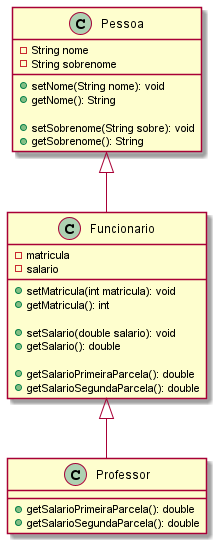

Professor: Fabrício Valadares Disciplina: Programação orientada a objetos
Curso: TADS/BSI Período: xo
Material: Avaliação Oficial I 4 de abril de 2021 Valor: 1000 pontos
Aluno: Nota:
Observações:
• Você tem até sábado, 10 de Abril de 2021, às 16:00 para finalizar a atividade.
• Dentro do período de execução da oficial I, 24 horas a partir das 00:00 do dia 05 de Abril de 2021 para
enviar no formulário disponível no AVA o link do github onde seu código será compartilhado.
• Se tiver dificuldades em utilizar o github em conjunto com sua IDE, sugiro utilizar a aplicação GitHub
Desktop.
– Link para download do Git, sistema de versionamento necessário para funcionamento do Git Hub
Desktop. (https://git-scm.com/)
– Link para criação de sua conta no github (https://github.com/)
– Link para download do GitHub Desktop (https://desktop.github.com/)
• Aprender a utilizar um sistema de versionamento é essencial para seu futuro como desenvolvedor de
software.
Você está participando do processo seletivo para uma vaga de desenvolvedor Java Junior. O teste prático está
descrito abaixo:
1. Escreva uma classe Pessoa, com os seguintes atributos:
• nome (String);
• sobrenome (String).
2. A classe deve conter os seguintes métodos:
(a) getters e setters;
(b) getNomeCompleto() que não possui parâmetros de entrada e que retorna a concatenação do nome
com o atributo sobrenome (utilize toString());
(c) Um construtor sem parâmetros;
(d) Outro construtor que recebe como parâmetros o nome e o sobrenome da pessoa.
3. Implemente também uma subclasse de Pessoa, chamada Funcionario. Esta classe deve ter os atributos
matricula (int) e salario (double), com seus respectivos métodos assessores e também um construtor que
invoca o construtor da superclasse.
4. O salário de um funcionário jamais poderá ser negativo. Todo funcionário recebe seu salario em duas
parcelas, sendo 60% na primeira parcela e 40% na segunda parcela. Assim, escreva os métodos:
(a) getSalarioPrimeiraParcela() que retorna o valor da primeira parcela do salário.
(b) getSalarioSegundaParcela() que retorna o valor da segunda parcela do salário.
5. Crie uma subclasse de Funcionario, chamado Professor. Todo professor recebe seu salário em uma única
parcela. Assim, devem-se sobrescrever os métodos getSalarioPrimeiraParcela() e getSalarioSegundaParcela().
O método getSalarioPrimeiraParcela() da classe Professor deve retornar o valor integral do salário
do professor e o método getSalarioSegundaParcela() do professor, deve retornar o valor zero. Crie também
um construtor que invoca o construtor da superclasse.
6. Em seu método main, crie objetos das três classes da hierarquia e imprima a qual classe cada objeto
pertence, obtendo esta informação por intermédio do método getClass() da classe Object.
1
7. Teste todas as funcionalidades!
8. Elabore o diagrama de classe do projeto, preferencialmente antes de colocar a mão na massa!
• Como será avaliado:
– Cumprimento dos requisitos (modelagem)
– Correto funcionamento da aplicação.
* Cada classe será avaliada individualmente
* Assim como a avaliação do todo
– Código
* Boas práticas de desenvolvimento orientado a objetos foram seguidas?
* Código limpo e organizado?
* Bem documentado?

